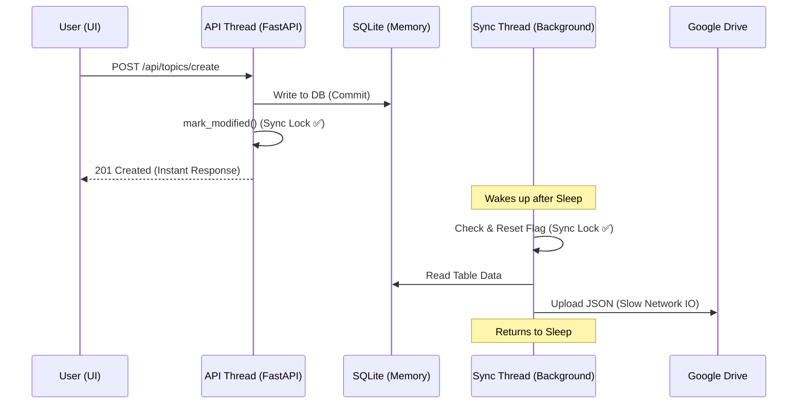

# 🧵 Synaptic — Concurrency & Database Guide

This document explains the internal mechanics of how Synaptic handles multi-threading, database persistence, and race-condition prevention.

---

## 1. 📂 Persistent In-Memory Database (SQLite)

Technically, an in-memory SQLite database (`:memory:`) is deleted as soon as its connection is closed. In a multi-threaded FastAPI app, this is a challenge because every request usually opens and closes a new connection.

### 🛠️ The Implementation: `StaticPool`
We solved this in `app/database.py` using SQLAlchemy's **`StaticPool`**:
- **Mechanism**: The pool maintains a **single** connection forever. 
- **Persistence**: No matter how many threads open a session, they all get routed to the same in-memory data.
- **`check_same_thread=False`**: By default, SQLite prevents different threads from using the same connection. We disable this check because SQLAlchemy's session management and SQLite's internal locking (shared/reserved/exclusive) safely manage the concurrency.

---

## 2. 🌀 The GDrive Sync Threading Logic

The synchronization happens in a "Daemon" thread. This means it runs in the background and shuts down automatically when the main app stops.

### 🚩 The "Race Condition" Problem
Multiple API worker threads are constantly writing to the database. We needed a way to signal the sync thread to work **without** making it sync every second (which would hit Google's rate limits).

### 🔐 The Solution: Atomic Locking
We use a `threading.Lock()` called `_sync_lock` in `app/services/gdrive_sync.py`:

1.  **Marking Changes**: When a user saves data, `mark_modified()` is called. It acquires the lock, sets `_HAS_CHANGES = True`, and releases the lock.
2.  **The Sync Loop**:
    - The sync thread wakes up every X seconds.
    - It **acquires the lock**.
    - It checks the flag. If `True`, it sets it to `False` **immediately** (Atomic Reset).
    - It **releases the lock**.
    - It then performs the slow Google Drive upload.

**Why reset BEFORE the upload?**
If a user adds a second note *while* the first sync is uploading, the `mark_modified()` function will set the flag back to `True`. Because the sync thread already cleared it, it will "know" that there is a new pending change and will run again in the next cycle.

---

## 3. 🛡️ Deadlock Prevention

A deadlock occurs when two threads are blocked waiting for each other $(A \to B \text{ and } B \to A)$.

**Synaptic is Deadlock-Safe because:**
- **No Circular Dependencies**: The API thread **never** waits for the GDrive sync to finish. It returns "Success" to the user immediately after writing to the local DB.
- **Resource Hierarchy**: Both threads respect a simple hierarchy. They access the Database Lock first, then the Sync Lock. They never try to acquire them in an interleaved fashion.

---

## 4. 📝 Request Lifecycle Diagram

---
*Documented on: 2026-03-03*
